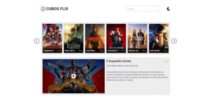
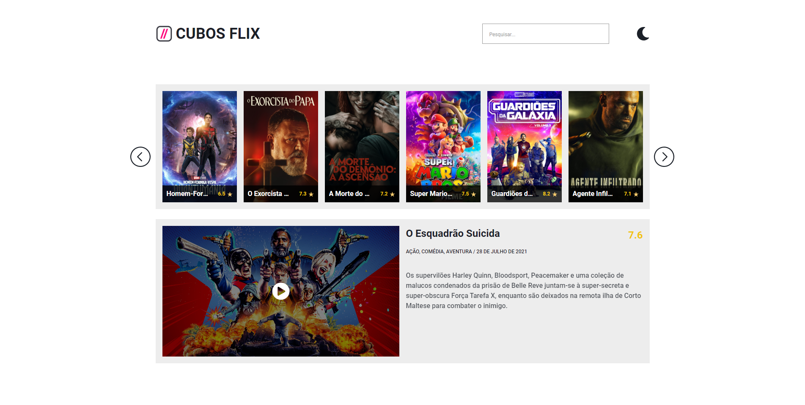
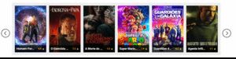
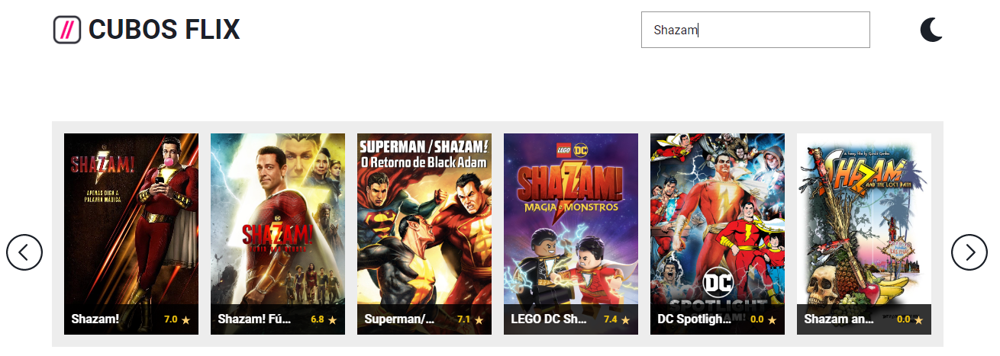
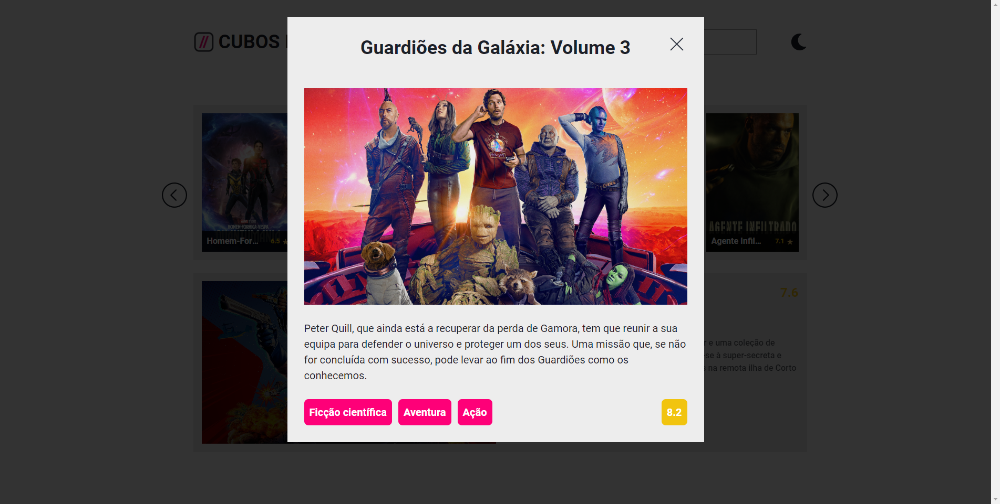
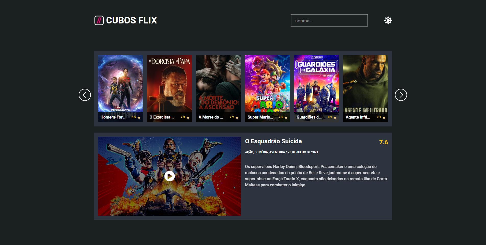
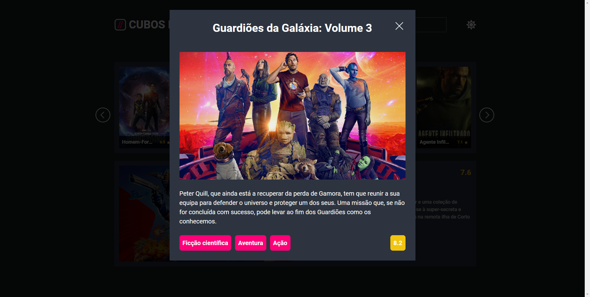

<h1 align="center">CUBOSFLIX</h1>



Site de streaming desenvolvido utilizando HTML, CSS e JavaScript.

O projeto consiste num site de streaming chamado CUBOSFLIX algo similar à NETFLIX que o usuário possa pesquisar seus filmes, vizualizá-los em cards, realizar paginação dos filmes, visualizar o filme do dia juntamente com o seu trailer oficial e por fim escolher entre o tema claro ou escuro.

## Funcionalidades

- Visualização de filmes
  
- Paginação de filmes
  

- Busca de filmes
  

- "Filme do dia"
  

- Modal de filme
  

- Mudança de tema
  
  

## Tecnologias utilizadas

- HTML
- CSS
- JavaScript

## Como executar o projeto

1. Instale o VScode em seu computador [neste link](https://code.visualstudio.com/download).

2. Abra o terminal e digite o seguinte comando:

```bash
git clone https://github.com/alissonromaosantos/cubosflix.git
```

3. Abra o projeto no seu VScode

4. Instale a extensão Live Server no seu VScode e em seguida clique em Go Live para iniciar um servidor local e o projeto será aberto no seu navegador

&copy; MIT LICENSE

Feito com 💜 Alisson Romão Santos.
